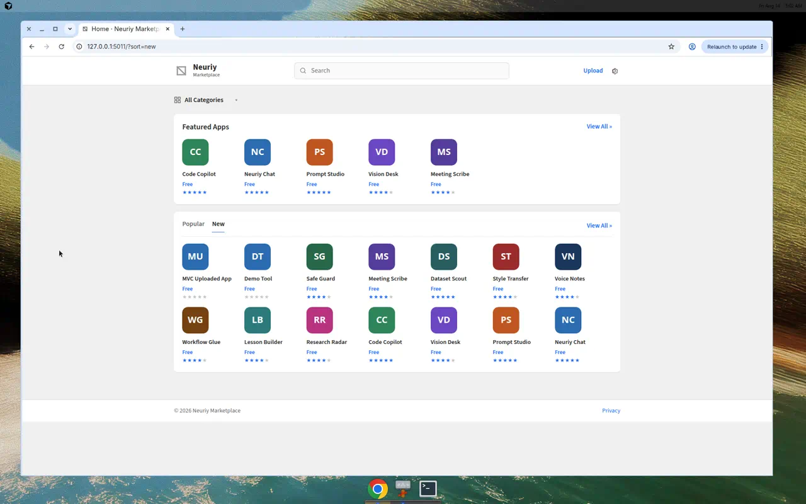
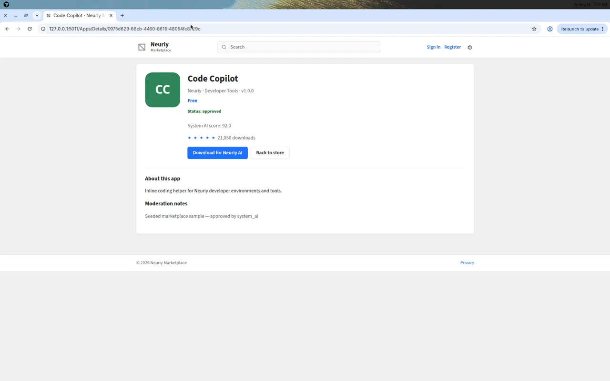
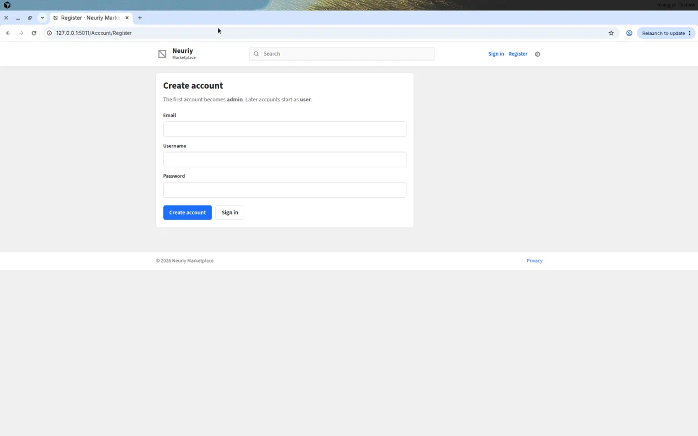
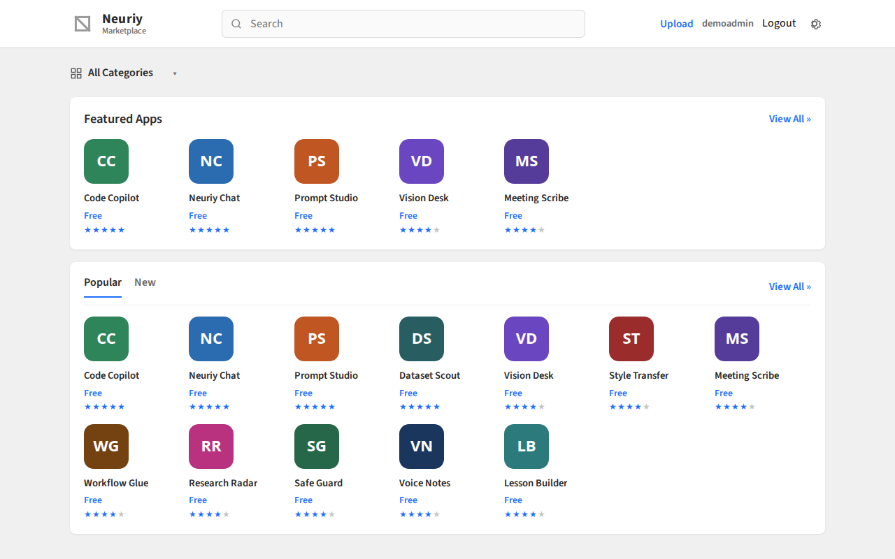
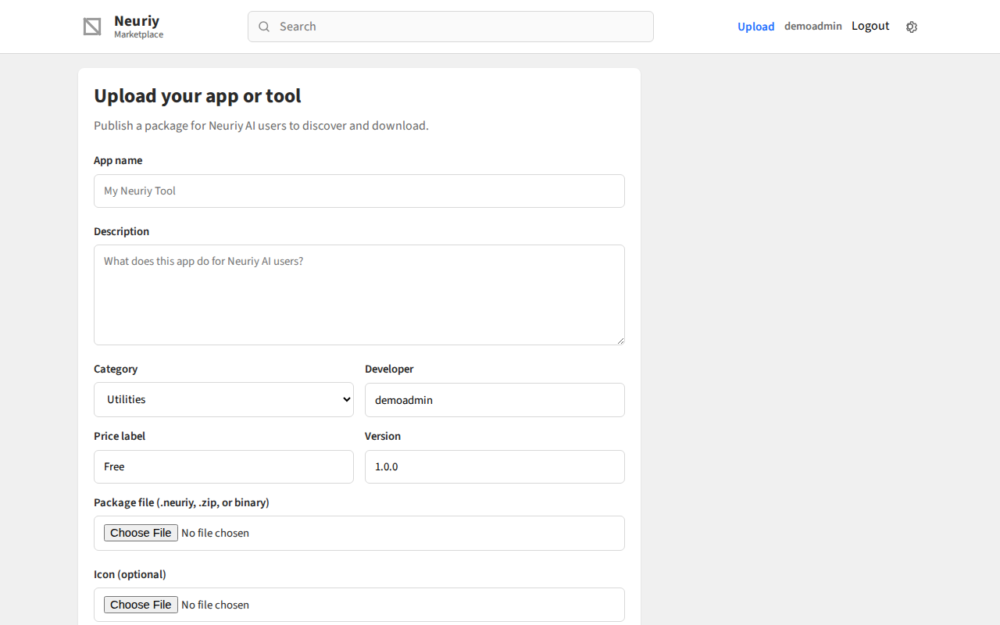
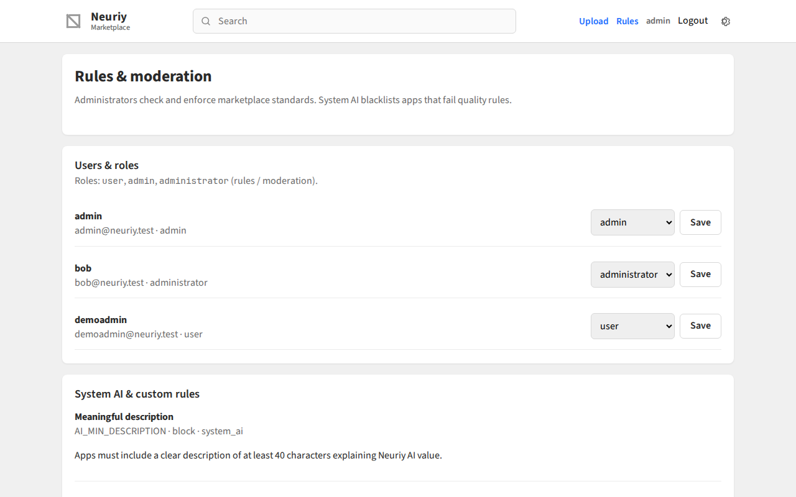

# Neuriy Marketplace

AI app store for **Neuriy AI** — browse, download, and publish apps/tools. Built as an ASP.NET Core MVC storefront with a Python FastAPI backend, styled as a close copy of the classic Firefox Marketplace layout.

## Demo

Walkthrough video (home → app details → register/login → upload → admin rules):

[](docs/media/neuriy-marketplace-walkthrough.mp4)

- [Watch walkthrough (MP4)](docs/media/neuriy-marketplace-walkthrough.mp4)
- [Slideshow demo (MP4)](docs/media/neuriy-marketplace-demo.mp4)

### Screenshots

#### Home store


#### New apps tab


#### App details


#### Register (first account becomes admin)


#### Signed-in home


#### Upload app


#### Admin rules & moderation


## Stack

| Layer | Tech |
| --- | --- |
| Web UI | ASP.NET Core 8 MVC (`src/NeuriyMarketplace.Web`) |
| API | Python FastAPI (`src/api`) |
| Database | Turso / libSQL (`libsql://neuriymp-ericksonholding.aws-eu-west-1.turso.io`) with local SQLite fallback |
| Auth | JWT sessions + roles (`user`, `admin`, `administrator`) |
| Moderation | System AI rules engine (blacklist low-standard apps) |

## Features

- Featured, Popular, and New app shelves
- Category filter and search
- App detail page with ratings and download counts
- Download packages for Neuriy AI
- Upload your own app/tool (package + optional icon)
- Register / sign-in (first account = admin)
- Admin / administrator rules & moderation panel

## Prerequisites

- .NET SDK 8+
- Python 3.10+

```bash
python3 -m pip install -r src/api/requirements.txt
```

## Run locally

Terminal 1 — Python API (port 8000):

```bash
chmod +x scripts/*.sh
./scripts/start-api.sh
```

Terminal 2 — .NET MVC storefront (port 5011):

```bash
./scripts/start-web.sh
```

Open [http://127.0.0.1:5011](http://127.0.0.1:5011).

API docs: [http://127.0.0.1:8000/docs](http://127.0.0.1:8000/docs).

## Configuration

`src/NeuriyMarketplace.Web/appsettings.json`:

```json
"MarketplaceApi": {
  "BaseUrl": "http://127.0.0.1:8000"
}
```

## Project layout

```
src/
  api/                      # FastAPI: auth, catalog, upload, download, rules
  NeuriyMarketplace.Web/    # MVC UI (Firefox Marketplace-style)
docs/media/                 # Screenshots + demo videos
scripts/
  start-api.sh
  start-web.sh
```

## API overview

- `POST /api/auth/register` · `POST /api/auth/login` · `GET /api/auth/me`
- `GET /api/apps` — list/search (`q`, `category`, `featured`, `sort`)
- `GET /api/apps/{id}` — app details
- `POST /api/apps` — multipart upload (auth required; system AI moderation runs)
- `GET /api/apps/{id}/download` — download approved package
- `GET /api/rules` · `POST /api/rules` — administrator/admin rule management
- `GET /api/apps/moderation/queue` — moderation queue
- `GET /api/categories` — category list

## Database (Turso / libSQL)

Default remote database:

```text
libsql://neuriymp-ericksonholding.aws-eu-west-1.turso.io
```

Set secrets before starting the API:

```bash
export TURSO_DATABASE_URL=libsql://neuriymp-ericksonholding.aws-eu-west-1.turso.io
export TURSO_AUTH_TOKEN=your-turso-token
export JWT_SECRET=change-me
```

If `TURSO_AUTH_TOKEN` is missing, the API falls back to local SQLite at `src/api/data/neuriy.db` so development still works.

Copy `src/api/.env.example` to `src/api/.env` if you prefer dotenv files.

## Accounts & roles

| Role | Who | Powers |
| --- | --- | --- |
| `admin` | **First registered account** | Full control, assign roles |
| `user` | Later signups | Browse, download approved apps, upload apps |
| `administrator` | Assigned by admin | Check/enforce rules, approve or blacklist apps |

## System AI rules

On every upload, `system_ai` scores the app against enabled rules (description quality, spam language, placeholder names, Neuriy relevance, categories). Apps below the quality threshold or failing block rules are **blacklisted** and cannot be downloaded until an administrator overrides.
